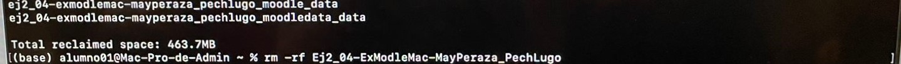

# **Tarea 2.4 Despliegue de un Sistema LMS Moodle con GitHub/Docker en una Mac Pro 2019**

**Carrera:** <u>Ing. Sistemas Computacionales</u> 

**Materia:** <u>Dev Ops</u> 

**Grupo:** <u>8SA</u> 

**Integrantes del equipo:** <u>May Peraza Luis Jesús // Pech Lugo Andrey Efrain</u>  

**Matricula:** <u>e20080436 // e20080437</u> 

**Nombre de la tarea:** <u>Despliegue de un Sistema LMS Moodle con GitHub/Docker en una Mac Pro 2019</u> 

**Número de la tarea:** <u>2.4</u>

## Desplegar un Sistema LMS Moodle usando Docker en una computadora Mac Pro  2019

### Clonar y correr el docker compose de Moodle

1. Bajar de **Github** a local con el comando git clone.

    
   

2.	Ver los archivo y directorios con el comando **ls -l**.

    
  	

3. Nos ubicamos en la carpeta **Ej2_04-ExModleMac-MayPeraza_PechLugo** con el comando **cd**.

    
   

4. Ver los archivo y directorios dentro de la carpeta **Ej2_04-ExModleMac-MayPeraza_PechLugo** con el comando **ls -l**

    
   

5. Escribimos el comando **cat** seguido del nombre del archivo "**docker-compose.yml**" para ver el contenido.

    

6. Escribimos el comando **docker-compose up -d**.

    

7. Escribimos el comando **docker ps** para asegurarnos que las imagenes respectivas esten corriendo.

    

8. Abrimos el navegador y en el campo de la barra superior escribimos la **ip de nuestra maquina**, que en nuestro caso es **127.0.0.1**.

    
  

9. Escribimos el comando **cd** para salir de la carpeta **Ej2_04-ExModleMac-MayPeraza_PechLugo** y luego escribimos el script **./limpiar.sh**.

    

10. Para finalizar escribimos el comando **rm -rf** seguido del nombre de la carpeta "**Ej2_04-ExModleMac-MayPeraza_PechLugo**" y luego escribimos el script **./limpiar.sh**.

    
   

### Instrucciones básicas para crear un curso

1. Para crear un curso primero hacemos click en **Log in** y escribimos el **usuario: user** y la **contraseña: bitnami** y hacemos click en **Log in**.

    

2. Para crear un curso primero hacemos click en la pestaña **Site administration**, luego hacemos click en **Courses** y por último hacemos click en **Add a new course**.

    
   

3.	Agregamos los datos requeridos del curso.

    
  	

4.	Hacemos click en **Save and display** para guardar y crear el curso.

    
  	
  	
5.	Hacemos click en la pestaña de **My Courses** y ahí podemos ver nuestro curso que recién creamos.

    
  	
